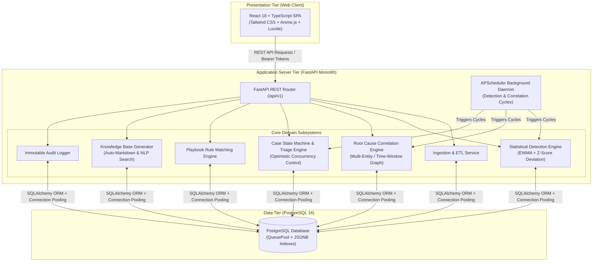
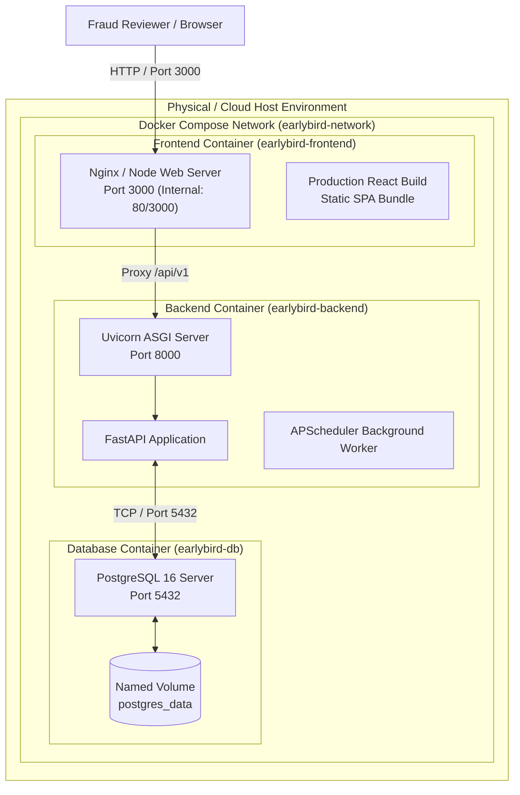
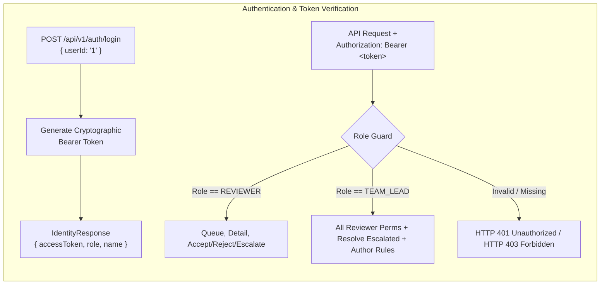

# EarlyBird — High-Level Design (HLD) Document

**System Name:** EarlyBird Transaction Fraud Anomaly Detection & Knowledge Platform  
**Document Version:** 1.0.0  
**Architectural Style:** Modular Monolith with Decoupled Internal Subsystems  
**Target Environment:** Dockerized Linux / Local Dev / Multi-Container Compose  

---

## 1. Architectural Philosophy & System Overview

EarlyBird is structured as a **Modular Monolith** rather than a distributed set of microservices. This design choice provides:
* **Single Deployment Unit**: Zero network latency or serialized RPC overhead between detection, correlation, and triage layers.
* **ACID Transaction Guarantees**: Anomaly detection, audit logging, and Knowledge Base writes occur within unified transactional boundaries.
* **Explicit Internal Seams**: Subsystems interact via well-defined domain services, enabling future microservice extraction if independent team scaling is required.

---

## 2. End-to-End Pipeline & Data Flow Architecture

The data pipeline progresses from raw transaction ingestion to detection, correlation, triage, and institutional documentation:

```mermaid
flowchart LR
    A[Raw Transactions<br/>Batch / Stream] --> B(Ingestion & Normalization)
    B --> C[(PostgreSQL<br/>transactions)]
    
    C --> D{Detection Engine<br/>Rolling Baseline}
    D -->|Z-Score >= 2.0σ| E[Anomalies Table]
    D -->|Z-Score < 2.0σ| F[Normal Transaction]
    
    E --> G{Root Cause Engine<br/>Temporal Graph}
    G --> H[Root Cause Links<br/>Evidence Graph]
    
    H --> I{Deduplication &<br/>Case Aggregator}
    I -->|Active Case Exists| J[Increment Duplicate Count]
    I -->|New Pattern| K[Create New Case]
    
    K --> L[Playbook Rules Matcher]
    L --> M[Recommended Action Displayed]
    
    M --> N{Analyst Triage Decision}
    N -->|Accept / Reject / Modify| O[Case RESOLVED]
    N -->|Complex Dispute| P[Case ESCALATED]
    N -->|SLA Timer Expires| P
    
    O --> Q[KB Auto-Generator]
    Q --> R[(Knowledge Base<br/>Indexed Precedent)]
```

---

## 3. Subsystem Breakdown & Responsibilities

### 3.1 Ingestion & Normalization Subsystem
* **Purpose**: Ingests raw card transaction records, maps entities (card IDs, merchant IDs, terminal IDs), and stores timestamps in UTC.
* **Key Components**: `app.models.Transaction`, `app.models.Entity`.

### 3.2 Detection Engine (Rolling Statistical Baselines)
* **Purpose**: Evaluates incoming transactions against rolling historical spending profiles per cardholder entity.
* **Algorithm**: Computes Exponentially Weighted Moving Average (EWMA) and Standard Deviation over rolling transaction windows. Calculates standard Z-score:
  $$Z = \frac{x - \mu_{\text{baseline}}}{\sigma_{\text{baseline}}}$$
* **Thresholding**: Automatically generates an `Anomaly` record whenever $Z \ge 2.0$.

### 3.3 Root Cause Correlation Subsystem
* **Purpose**: Resolves the "black-box alert" problem by linking flagged anomalies with contextual background transactions.
* **Heuristics**:
  * **Same Entity Velocity**: Rapid successive transactions on the same card within $< 15\text{ minutes}$.
  * **Merchant Terminal Point of Compromise**: Multiple distinct cards experiencing unauthorized charges after transacting at the same merchant.
  * **Geographic Impossibility**: Transactions occurring at physical locations separated by unrealistic travel times.
* **Output**: Writes to `root_cause_links` with evidence JSON payloads.

### 3.4 Case Management & Triage Subsystem
* **Purpose**: Deduplicates anomalies into manageable operational units (Cases) and governs their lifecycle through a strict Finite State Machine.
* **States**: `NEW`, `ACCEPTED` (In Progress), `ESCALATED`, `RESOLVED`.
* **Concurrency**: Implements Optimistic Concurrency Control using a database `version` column to prevent overwrites when multiple reviewers triage cases concurrently.

### 3.5 Playbook Rules Subsystem
* **Purpose**: Allows Team Leads to author deterministic if-this-then-that operational policies.
* **Matching**: Evaluates conditions (e.g. `amount_min`, `z_score_min`, `category`, `mcc`) and attaches automated recommendation text to cases before human review.

### 3.6 Auto-Documenting Knowledge Base Subsystem
* **Purpose**: Automatically generates permanent, searchable forensic documentation upon case resolution.
* **Indexing**: Stores rich Markdown summaries with categorized metadata (`CNP e-Commerce`, `Velocity Burst`, `Account Takeover`, `Compromised Terminal`, `Geographic Impossibility`, `Authorized Travel`).
* **Search**: Full-text neural/keyword search across precedent titles, card IDs, and evidence summaries.

### 3.7 Audit & Compliance Subsystem
* **Purpose**: Append-only tamper-evident event stream capturing every state transition, rationale, reviewer action, and SLA event.

---

## 4. Technology Stack & Component Mapping

| Subsystem / Layer | Technology Selected | Technical Rationale |
|---|---|---|
| **Frontend Framework** | React 18 + TypeScript | Component modularity, strong static typing, responsive UI state management. |
| **Styling & Design System** | Tailwind CSS + Custom CSS Variables | OLED dark-mode palette (`#08090C`, `#111218`), electric sky glow accents, accessible contrast. |
| **Backend API Framework** | Python 3.11 + FastAPI | Native asynchronous endpoints, automatic OpenAPI/Swagger generation, Pydantic type safety. |
| **ORM & Database Driver** | SQLAlchemy 2.0 + Psycopg2 | Type-annotated ORM models, transaction management, connection pool recycling (`QueuePool`). |
| **Database Engine** | PostgreSQL 16 | ACID compliance, JSONB document indexing, robust full-text search vector support. |
| **Job Scheduling Daemon** | APScheduler (BackgroundScheduler) | In-process daemon executing periodic detection and correlation cycles without external Redis overhead. |

---

## 5. Deployment & Container Infrastructure Architecture

### Container Specifications:
* **`earlybird-frontend`**: Serves compiled React assets, handles SPA fallback routing, and proxies API traffic.
* **`earlybird-backend`**: Runs FastAPI under Uvicorn with auto-lifespan initialization (seeding default users and starting APScheduler jobs).
* **`earlybird-db`**: PostgreSQL 16 with persistent volume storage and `pg_isready` health check definitions.

---

## 6. Security, RBAC & Authentication Design

* **Token Scheme**: Bearer tokens containing encoded role identifiers (`REVIEWER`, `TEAM_LEAD`).
* **Route Protection**: FastAPI dependency injection (`Depends(get_current_user)`) verifies user identity and role authorizations on every write operation.
