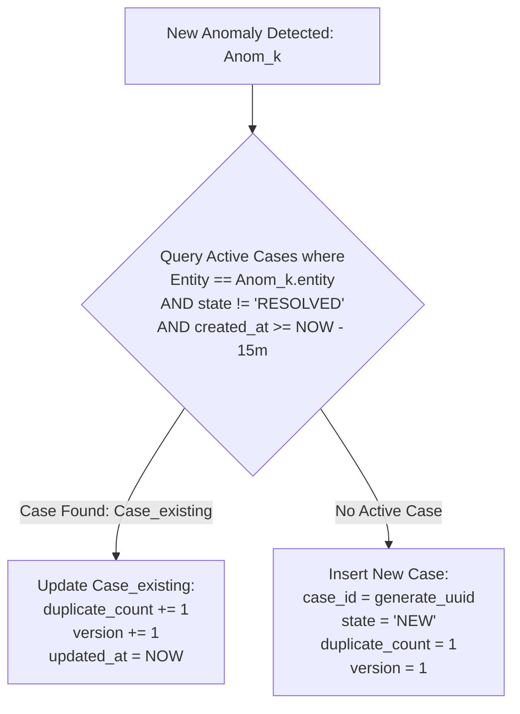
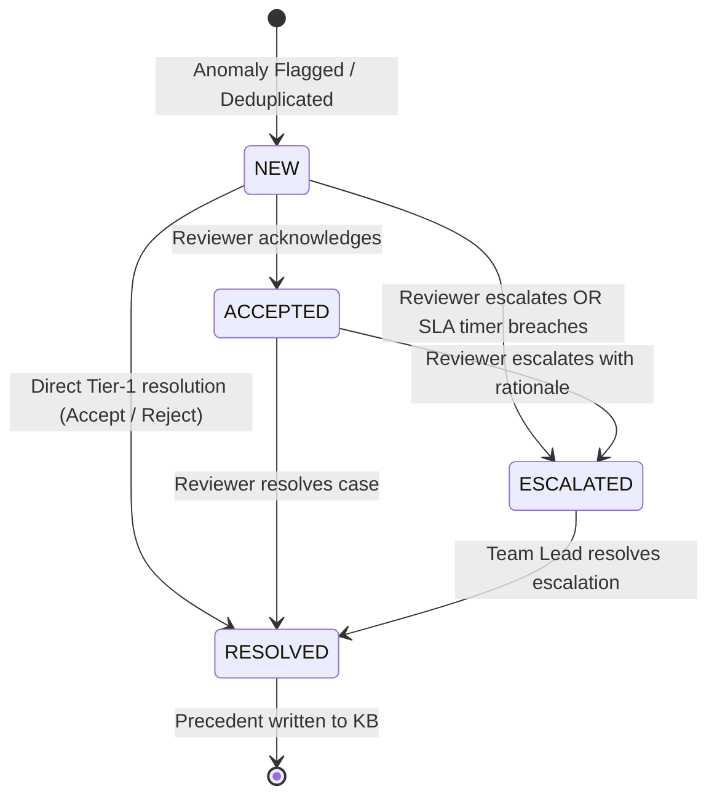
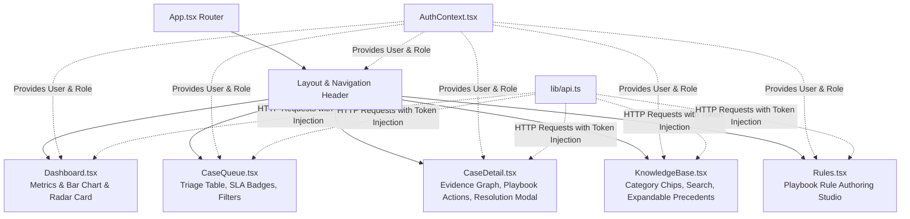

# EarlyBird — Low-Level Design (LLD) Document

**System Name:** EarlyBird Transaction Fraud Anomaly Detection & Knowledge Platform  
**Document Version:** 1.0.0  
**Target Runtime:** Python 3.11 / FastAPI / PostgreSQL 16 / React 18 TypeScript  

---

## 1. Codebase Directory Structure & Module Seams

```
EarlyBird/
├── backend/
│   ├── app/
│   │   ├── main.py                     # FastAPI application entrypoint & lifespan
│   │   ├── database.py                 # SQLAlchemy engine, QueuePool & session factory
│   │   ├── models.py                   # Reconciled ORM entities (9 tables)
│   │   ├── auth.py                     # Token generation, user lookup & dependencies
│   │   ├── cases/
│   │   │   ├── state_machine.py        # Case FSM transitions & validation guards
│   │   │   └── concurrency.py          # Optimistic locking (StaleEntityException)
│   │   ├── detection/
│   │   │   ├── service.py              # Detection cycle runner & batch processor
│   │   │   └── baseline.py             # EWMA baseline & z-score calculation
│   │   ├── correlation/
│   │   │   └── service.py              # Root cause link discovery & graph generation
│   │   ├── playbooks/
│   │   │   └── recommender.py          # Playbook rule matching & recommendation engine
│   │   ├── knowledge_base/
│   │   │   ├── generator.py            # Case-to-Markdown precedent generator
│   │   │   └── search.py               # Full-text & filtered KB search
│   │   ├── scheduler/
│   │   │   ├── detection_cycle.py      # 5-minute APScheduler job
│   │   │   └── correlation_cycle.py    # 10-minute APScheduler job
│   │   └── routers/
│   │       ├── auth.py                 # /api/v1/auth endpoints
│   │       ├── cases.py                # /api/v1/cases triage & action endpoints
│   │       ├── knowledge_base.py       # /api/v1/knowledge-base precedent endpoints
│   │       ├── playbooks.py            # /api/v1/playbooks rule management
│   │       └── dashboard.py            # /api/v1/dashboard telemetry & KPI metrics
│   ├── scripts/
│   │   ├── seed_test_data.py           # Database seeder (10k txns, anomalies, cases)
│   │   └── seed_rich_precedents.py     # Precedent populator across fraud categories
│   └── tests/                          # Pytest test suites (unit & integration)
└── frontend/
    ├── src/
    │   ├── App.tsx                     # React Router definition & protected routes
    │   ├── context/
    │   │   └── AuthContext.tsx         # User authentication & role switching state
    │   ├── lib/
    │   │   ├── api.ts                  # Axios API client wrapper with bearer auth
    │   │   └── constants.ts            # Enums (CaseState, CaseSeverity, UserRole)
    │   ├── pages/
    │   │   ├── Login.tsx               # Demo login & role selection screen
    │   │   ├── Dashboard.tsx           # Telemetry metrics, category chart & radar
    │   │   ├── KnowledgeBase.tsx       # Precedents library & category filtering
    │   │   ├── cases/
    │   │   │   ├── Queue.tsx           # Case triage table with SLA indicators
    │   │   │   └── Detail.tsx          # Full investigation & resolution studio
    │   │   └── settings/
    │   │       └── Rules.tsx           # Playbook rule authoring & toggle interface
    │   └── components/                 # Reusable UI components & charts
    └── server.js                       # Production Node.js SPA web server
```

---

## 2. Database Schema & Entity-Relationship Diagram (ERD)

```mermaid
erDiagram
    users ||--o{ audit_log : "performs action"
    entities ||--o{ transactions : "initiates"
    transactions ||--o{ anomalies : "flagged as"
    anomalies ||--o{ cases : "grouped into"
    anomalies ||--o{ root_cause_links : "source anomaly"
    cases ||--o{ knowledge_base : "generates precedent"
    cases ||--o{ audit_log : "audited by"

    users {
        int id PK
        string user_id UK "e.g. '1', '2'"
        string name "e.g. 'Reviewer Alex'"
        string role "REVIEWER or TEAM_LEAD"
        boolean is_active
        datetime created_at
    }

    entities {
        int id PK
        string entity_type "card, merchant, terminal"
        string entity_identifier UK "e.g. CARD_10, MERCHANT_12"
        datetime created_at
    }

    transactions {
        int id PK
        string transaction_id UK
        string card_id FK
        string merchant_id
        float amount
        datetime timestamp
        int label "0 = legitimate, 1 = fraud"
        datetime created_at
    }

    anomalies {
        int id PK
        int transaction_id FK
        string entity_id
        string metric "e.g. 'amount'"
        string severity "HIGH, MEDIUM, LOW"
        float score "Z-Score deviation"
        float baseline "Baseline mean"
        float deviation "Deviation amount"
        float observed_value
        json evidence "Snapshot why anomaly fired"
        datetime created_at
    }

    cases {
        int id PK
        string case_id UK "e.g. CASE-0389583F"
        int anomaly_id FK
        string state "NEW, ACCEPTED, ESCALATED, RESOLVED"
        string severity "HIGH, MEDIUM, LOW"
        int priority "1 (high) to 5 (low)"
        string assigned_to
        datetime sla_deadline
        int duplicate_count "Dedup counter"
        int version "Optimistic lock version"
        json recommendations "Array of rule actions"
        datetime created_at
        datetime updated_at
        datetime resolved_at
    }

    root_cause_links {
        int id PK
        int anomaly_id FK
        int related_anomaly_id
        string related_transaction_id
        string link_type "same_entity, velocity_burst, etc."
        float correlation_strength
        text explanation
        json evidence
        datetime created_at
    }

    playbook_rules {
        int id PK
        string name
        string description
        json condition_json "{ amount_min: 5000 }"
        string recommendation
        int priority "1-10"
        int enabled "1 = active, 0 = disabled"
    }

    knowledge_base {
        int id PK
        string case_id UK FK
        string title
        text content "Structured Markdown"
        datetime created_at
    }

    audit_log {
        int id PK
        string entity_type "case, rule, etc."
        string entity_id
        string action "CASE_ACCEPTED, CASE_ESCALATED, etc."
        string actor_id "User ID or 'SYSTEM'"
        string reason
        json changes
        datetime created_at
    }
```

---

## 3. Mathematical Models & Core Algorithms

### 3.1 Statistical Anomaly Detection (EWMA Baseline)

The baseline model maintains a rolling Exponentially Weighted Moving Average ($\mu_t$) and Variance ($\sigma_t^2$) for each entity across transaction series:

$$\mu_t = \alpha \cdot x_t + (1 - \alpha) \cdot \mu_{t-1}$$

$$\sigma_t^2 = \beta \cdot (x_t - \mu_t)^2 + (1 - \beta) \cdot \sigma_{t-1}^2$$

Where $\alpha = 0.1$ and $\beta = 0.1$ represent smoothing parameters.

**Z-Score Deviation Metric**:
$$Z(x_t) = \frac{x_t - \mu_{t-1}}{\sqrt{\sigma_{t-1}^2} + \epsilon}$$

An anomaly is flagged when:
$$|Z(x_t)| \ge Z_{\text{threshold}} \quad (\text{Default: } Z_{\text{threshold}} = 2.0)$$

### 3.2 Root Cause Correlation Algorithm

For any flagged anomaly $A_i = (E_i, T_i, \text{Score}_i)$, the engine searches for contextual transactions $T_j$ within window $\Delta t = [T_i - 2\text{ hours}, T_i]$:

1. **Entity Velocity Correlation**:
   $$S_{\text{velocity}} = \min\left(1.0, \frac{\text{Count}(T \in \Delta t \mid \text{Entity} = E_i)}{5}\right)$$

2. **Merchant Point of Compromise (PoC)**:
   $$S_{\text{PoC}} = \frac{\text{Distinct Cards Compromised at Merchant } M}{\text{Total Cards Transacting at } M}$$

3. **Overall Correlation Strength**:
   $$S_{\text{total}} = 0.6 \cdot S_{\text{velocity}} + 0.4 \cdot S_{\text{PoC}}$$

A `root_cause_link` is established if $S_{\text{total}} \ge 0.5$.

### 3.3 Case Deduplication Windowing Algorithm



---

## 4. Case State Machine & Concurrency Model

### 4.1 State Transition Matrix



| Source State | Target State | Action / Event | Authorized Roles | Required Payload |
|---|---|---|---|---|
| `NEW` | `ACCEPTED` | `CASE_ACKNOWLEDGED` | `REVIEWER`, `TEAM_LEAD` | `version` |
| `NEW` / `ACCEPTED` | `ESCALATED` | `CASE_ESCALATED` | `REVIEWER`, `TEAM_LEAD`, `SYSTEM` | `version`, `reason` ($\ge 10$ chars) |
| `NEW` / `ACCEPTED` | `RESOLVED` | `CASE_ACCEPTED` | `REVIEWER`, `TEAM_LEAD` | `version`, `category`, `decision` |
| `NEW` / `ACCEPTED` | `RESOLVED` | `CASE_REJECTED` | `REVIEWER`, `TEAM_LEAD` | `version`, `rationale` (mandatory) |
| `ESCALATED` | `RESOLVED` | `CASE_RESOLVED` | `TEAM_LEAD` (Strict) | `version`, `decision`, `rationale` |

### 4.2 Optimistic Concurrency Control Implementation
To guarantee that two analysts do not overwrite each other's triage decisions:

```python
# Concurrency Guard in app.cases.state_machine:
def transition_case(db: Session, case: Case, user: User, target_state: str, action: str, expected_version: int, ...):
    if case.version != expected_version:
        raise StaleEntityException(
            f"Case was modified by another user. Current version: {case.version}, submitted version: {expected_version}"
        )
    
    # Apply transition
    case.state = target_state
    case.version += 1
    case.updated_at = datetime.utcnow()
    
    # Immutable audit logging in same ACID transaction
    audit_entry = AuditLog(
        entity_type="case",
        entity_id=case.case_id,
        action=action,
        actor_id=user.user_id,
        changes={"state": target_state, "version": case.version, ...}
    )
    db.add(audit_entry)
```

---

## 5. API Contracts & Endpoint Specifications

### 5.1 Authentication (`/api/v1/auth`)
* `POST /api/v1/auth/login`:
  * Request: `{ "userId": "1" }`
  * Response: `{ "accessToken": "token_reviewer_1", "role": "REVIEWER", "userId": "1", "name": "Reviewer Alex" }`
* `GET /api/v1/auth/session`:
  * Header: `Authorization: Bearer <token>`
  * Response: Returns active user identity or HTTP 401.

### 5.2 Case Triage & Actions (`/api/v1/cases`)
* `GET /api/v1/cases?state=ALL&limit=20&offset=0`:
  * Returns list of cases, SLA remaining time, anomaly score, severity, and deduplication count.
* `GET /api/v1/cases/{caseId}`:
  * Returns full investigation read-model: baseline mean, standard deviation, observed amount, root cause links, matched playbook rules, audit history, and associated `knowledge_base_entry`.
* `POST /api/v1/cases/{caseId}/action`:
  * Request:
    ```json
    {
      "decision": "ACCEPTED",
      "version": 1,
      "category": "CARD_NOT_PRESENT_FRAUD",
      "verification_methods": ["EWMA Rolling Velocity Baseline Analyzed"],
      "rationale": "Verified fraud pattern via telephone confirmation."
    }
    ```
  * Response: Updated case with state `RESOLVED` and auto-generated KB reference.

### 5.3 Knowledge Base Library (`/api/v1/knowledge-base`)
* `GET /api/v1/knowledge-base?search=&category=CNP&page=1&pageSize=20`:
  * Returns categorized precedents sorted newest-first with linked `case_id`, `card_id`, `amount`, `decision`, and full markdown summaries.
* `GET /api/v1/knowledge-base/{id}`:
  * Returns detailed precedent report and forensic metadata.
* `GET /api/v1/knowledge-base/case/{caseId}`:
  * Looks up precedent directly by linked case ID.

### 5.4 Dashboard Telemetry (`/api/v1/dashboard/metrics`)
* Returns aggregated platform telemetry: MTTD, MTTR, SLA compliance percentage, deduplication efficiency, and forensic category breakdown for charting.

---

## 6. Frontend Component Architecture


