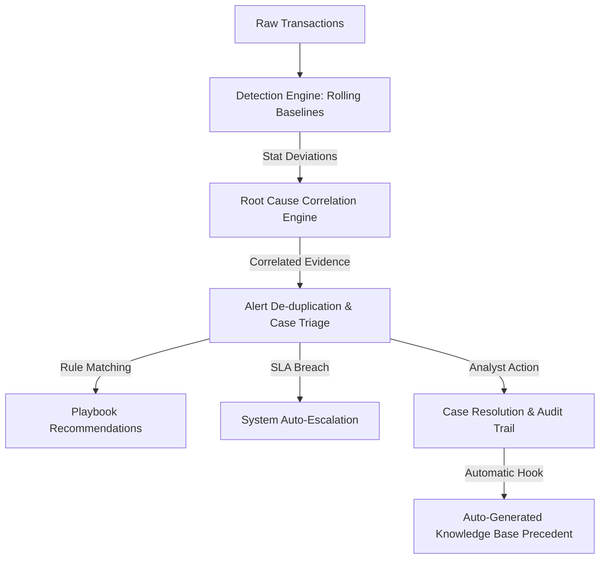
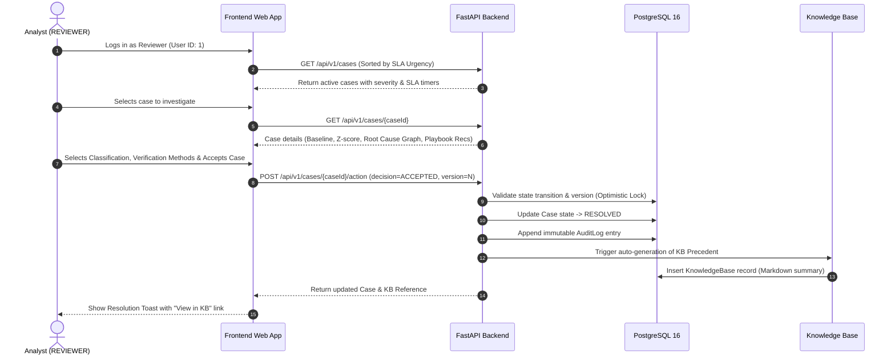
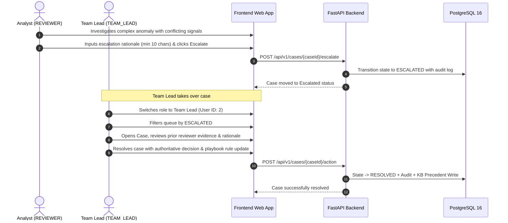
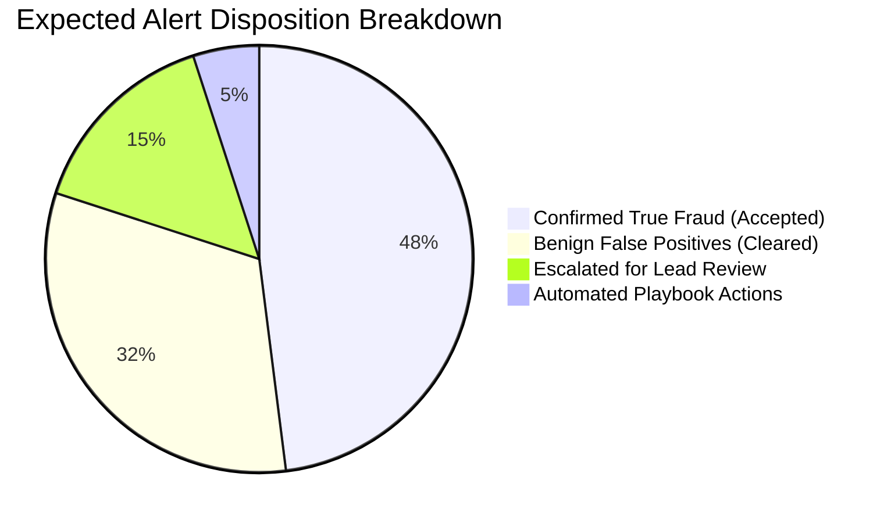

# EarlyBird — Product Requirements Document (PRD)

**Product Name:** EarlyBird — Transaction Fraud Anomaly, Root Cause Analysis & Knowledge Platform  
**Document Version:** 1.0.0  
**Status:** Approved Baseline  
**Document Owner:** EarlyBird Engineering Team  

---

## 1. Executive Summary & Vision

Traditional fraud detection platforms suffer from four acute operational failures:
1. **Black-Box Alerts**: Anomalies are flagged with risk scores without explainable contributing factors.
2. **Ephemeral Institutional Knowledge**: When an analyst investigates and resolves a complex incident, the forensic reasoning is lost in tickets rather than codified into institutional memory.
3. **Implicit Communication & SLA Drift**: Alert ownership, handoffs, and escalations lack explicit auditability, leading to missed SLA deadlines.
4. **Alert Fatigue & Noise**: High-volume, near-duplicate anomalies flood triage queues without intelligent grouping.

**EarlyBird** is an intelligent transaction anomaly detection and case triage platform designed to turn alert resolution into an institutional knowledge asset. It combines rolling statistical baseline detection, multi-signal root cause correlation, optimistic concurrency-controlled alert triage, deterministic playbook authoring, and auto-generated knowledge base documentation.

---

## 2. Target User Personas & Roles

EarlyBird models three operational actors with strict Role-Based Access Control (RBAC):

| Persona / Actor | Role Name | Primary Responsibilities | Key Needs in UI / API |
|---|---|---|---|
| **Fraud Analyst** | `REVIEWER` | Monitors queue, investigates anomaly evidence, accepts/rejects alerts, escalates edge cases. | Instant triage queue, root cause correlation graphs, one-click playbook actions, SLA urgency indicators. |
| **Team Lead / Admin** | `TEAM_LEAD` | Resolves escalated disputes, authors deterministic playbook rules, analyzes SLA & detection metrics. | Escalated cases queue, rule authoring studio, override capability, MTTD/MTTR telemetry dashboard. |
| **Automated Scheduler** | `SYSTEM` | Periodic stream scoring, correlation discovery, SLA deadline enforcement, auto-escalation. | Deterministic batch scheduler, immutable audit log writer, append-only persistence. |

---

## 3. Core Product Workflows

### 3.1 Reviewer Investigation & Resolution Journey (Happy Path)

### 3.2 Escalation & Team Lead Resolution Journey

---

## 4. Functional Requirements

### 4.1 Detection & Ingestion `[FR-DET]`
* **FR-010**: The system shall ingest batch transaction feeds (e.g. credit card transaction datasets) into unified `entities` and `transactions` tables.
* **FR-011**: The system shall calculate rolling statistical baselines (Exponentially Weighted Moving Average and Standard Deviation) per entity.
* **FR-012**: The system shall compute Z-score deviations ($Z = \frac{x - \mu}{\sigma}$) for transaction amounts and flag transactions exceeding the configured threshold ($Z \ge 2.0$) as anomalies.

### 4.2 Root Cause Analysis & Correlation `[FR-RCA]`
* **FR-020**: For every flagged anomaly, the system shall correlate related recent transactions across the same card, same merchant, or same temporal window.
* **FR-021**: The system shall compute a correlation strength score ($0.0 \le s \le 1.0$) and record explicit `root_cause_links` explaining contributing factors.
* **FR-022**: If no contributing factors are found, the system shall explicitly report "No contributing factors found" rather than returning an empty or broken payload.

### 4.3 Alert Triage, Deduplication & SLA `[FR-ALT]`
* **FR-030**: Near-identical anomalies on the same entity within a rolling deduplication window (e.g. 15 minutes) shall merge into an existing active Case, incrementing `duplicate_count`.
* **FR-031**: Every Case shall be assigned an objective severity (`HIGH`, `MEDIUM`, `LOW`) based on deviation score and transaction volume.
* **FR-032**: Every Case shall have a deterministic SLA deadline computed from severity:
  * `HIGH`: 15 minutes
  * `MEDIUM`: 30 minutes
  * `LOW`: 60 minutes
* **FR-033**: If a case remains unacknowledged past its SLA deadline, the automated scheduler shall transition the case to `ESCALATED` with an audit log actor of `SYSTEM`.

### 4.4 Playbook Recommendations `[FR-REC]`
* **FR-040**: The system shall evaluate active playbook rules against case attributes and display matching recommended actions.
* **FR-041**: If an analyst accepts a recommendation, the decision is recorded as `ACCEPTED`.
* **FR-042**: If an analyst rejects or modifies a recommendation, the system must enforce a non-empty rationale (HTTP 400 if omitted).

### 4.5 Auto-Generated Knowledge Base `[FR-DOC]`
* **FR-050**: Resolving any case shall atomically generate a formatted Markdown Knowledge Base precedent containing executive summary, evidence metrics, verified methods, and decision rationale.
* **FR-051**: The Knowledge Base shall be accessible via full-text search and category filter tabs (`CNP e-Commerce`, `Velocity Bursts`, `Account Takeover`, `Compromised Terminal`, `Geographic Impossibility`, `Authorized Travel`).
* **FR-052**: Precedents in the Knowledge Base shall be ordered by recency (newest first) by default and provide one-click deep links back to the original case investigation.

### 4.6 Audit Trail & Role-Based Access Control `[FR-AUD / FR-SEC]`
* **FR-060**: Every state transition, priority change, and decision must append an immutable record to `audit_log` with actor ID, timestamp, action, and JSON change payload.
* **FR-061**: Only users with role `TEAM_LEAD` can create, update, or deactivate playbook rules.
* **FR-062**: Only users with role `TEAM_LEAD` can resolve an `ESCALATED` case.

### 4.7 Operational Metrics & Telemetry `[FR-MET]`
* **FR-070**: The platform dashboard shall expose real-time metrics for:
  * Mean Time to Detect (MTTD)
  * Mean Time to Resolve (MTTR)
  * Alert Deduplication Efficiency Rate
  * SLA Breach Rate
  * Knowledge Base Documentation Coverage Percentage

---

## 5. Non-Functional Requirements (NFR)

| ID | Category | Requirement Description | Success Metric |
|---|---|---|---|
| **NFR-010** | **Performance** | Queue and dashboard data queries must execute with sub-second response times. | API P95 $< 100\text{ms}$ on local environment. |
| **NFR-020** | **Concurrency** | The system must prevent race conditions and lost updates during simultaneous analyst triage. | Enforced via Optimistic Concurrency Control (`version` integer increment). |
| **NFR-030** | **Safety** | No autonomous or irreversible actions shall be executed without human confirmation. | All system actions are informational/triage routing only. |
| **NFR-040** | **Data Integrity** | The audit log table must be append-only and strictly tamper-evident. | Enforced at database schema level; no `UPDATE` or `DELETE` allowed on audit rows. |
| **NFR-050** | **Explainability** | Every detector score and playbook recommendation must provide inspectable mathematical evidence. | All anomalies contain complete `evidence` JSON snapshots. |

---

## 6. Out-of-Scope (Deliberate Non-Goals)

To maintain focus and high software engineering quality within project constraints, the following enterprise elements are explicitly out of scope:
1. **Autonomous Account Debiting/Freezing**: EarlyBird only handles triage and recommendation, leaving banking core execution to external human-approved systems.
2. **Predictive Black-Box Deep Learning Pipelines**: Real-time rule-based playbooks and transparent Z-score baselines are used instead of opaque neural networks.
3. **Multi-Tenant Database Partitioning**: Single-tenant architecture with unified RBAC.
4. **Distributed Microservices Topology**: Implemented as a clean, cohesive modular monolith with internal separation of concerns.

---

## 7. Product Success Metrics

* **Alert Volume Reduction**: $\ge 35\%$ alert reduction via temporal deduplication.
* **Documentation Completeness**: $100\%$ of resolved cases produce an indexed Knowledge Base precedent.
* **Mean Time to Resolve (MTTR)**: Sub-15 minute average resolution time for Tier-1 analysts guided by playbook recommendations.
