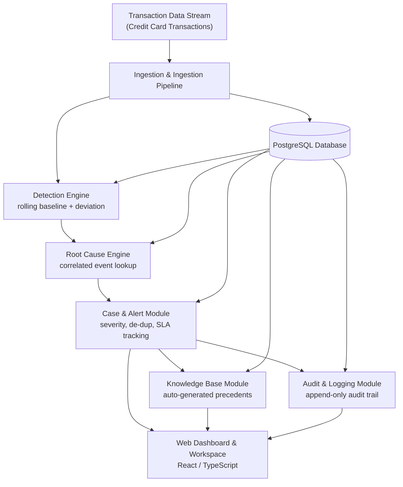
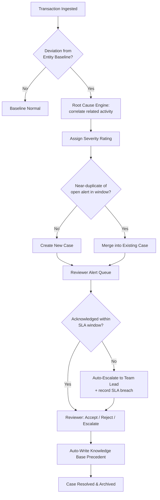
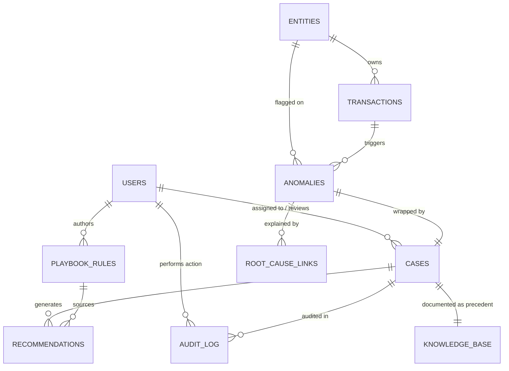
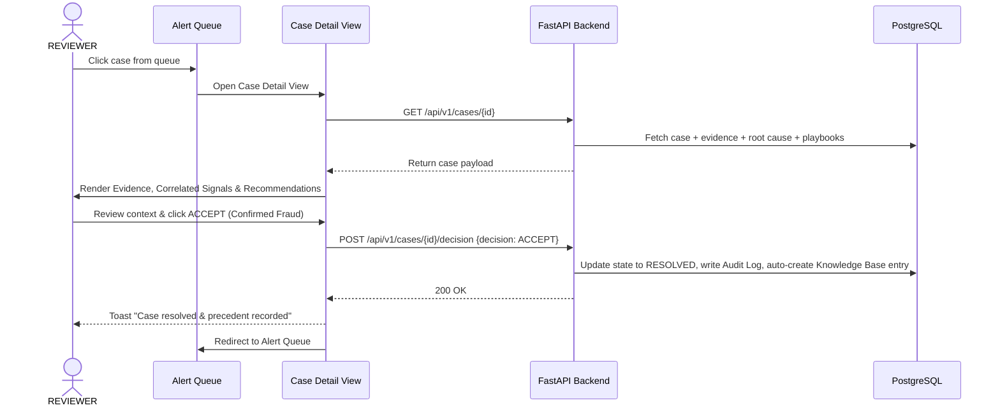
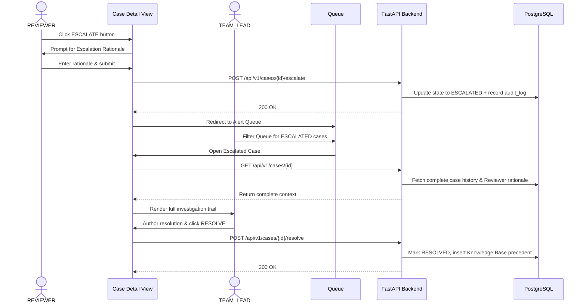

# EarlyBird — Transaction Fraud Anomaly Detection, Root Cause & Knowledge Platform

**Deployment Links:**
* **Frontend Application**: [https://early-bird-pi.vercel.app](https://early-bird-pi.vercel.app)
* **Backend API**: [https://earlybird-werz.onrender.com](https://earlybird-werz.onrender.com)

> **EarlyBird** is a real-time transaction fraud anomaly detection platform focused on explainable **Root Cause Analysis (RCA)**, **Auto-Generated Knowledge Base Precedents**, **Auditability**, and **Intelligent Alert Triage**. Built with **Python / FastAPI**, **PostgreSQL**, and **React / TypeScript**.

---

## 1. Executive Summary

Credit card fraud detection systems in enterprise production often suffer from high noise-to-signal ratios, fragmented context, and institutional memory loss. When alerts fire in isolation, fraud analysts waste valuable time manually gathering context across logs, making judgment calls that are rarely captured systematically.

**EarlyBird** addresses this by providing a unified, human-in-the-loop triage system that:
1. **Detects Anomalies**: Employs statistical baseline deviation engines ($z$-score and rolling baselines) to identify suspicious transaction activity.
2. **Correlates Root Causes**: Automatically aggregates related entity events (velocity spikes, high-value bursts, merchant category shifts) to explain *why* an anomaly was flagged.
3. **Triage & Escalation**: Manages cases across a two-tier review hierarchy (**REVIEWER** analysts and **TEAM_LEAD** supervisors) with strict SLA tracking and optimistic concurrency controls.
4. **Auto-Generates Documentation**: Converts every resolved incident into an indexed, searchable **Knowledge Base Precedent**, transforming individual case resolutions into an evolving institutional memory.

---

## 2. The Fraud Detection Problem

Credit card fraud operations face significant structural challenges:

* **High False-Positive Noise**: Traditional static rules produce 70–90% false-positive rates, leading to severe alert fatigue.
* **Context Loss During Escalation**: When a reviewer escalates an ambiguous case to a supervisor, research context is lost, forcing duplicate investigation effort.
* **No Institutional Feedback Loop**: Resolved cases are rarely archived as structured post-mortems, causing organizations to repeat analysis on recurring fraud patterns.
* **Lack of Auditability**: State transitions and reviewer rationales are stored across email threads or unstructured tickets rather than an append-only audit trail.

---

## 3. The Four Core Focus Areas

EarlyBird is structured around four architectural pillars:

| Focus Area | Objective | Implementation |
| :--- | :--- | :--- |
| **Root Cause Analysis `[RCA]`** | Provide instant, explainable context alongside flagged anomalies. | Statistical baseline ($z$-score) deviation + correlated entity activity lookup. |
| **Documentation `[DOC]`** | Turn case resolutions into reusable organizational memory. | Auto-generated Knowledge Base precedent entries written in the same DB transaction as case resolution; full-text search via PostgreSQL `tsvector`. |
| **Communication & Audit `[COMM]`** | Ensure 100% loss-less escalation and strict audit compliance. | Immutable, append-only `audit_log` recording every state transition, actor, timestamp, and rationale. |
| **Alert Triage & Deduplication `[ALERT]`** | Reduce alert fatigue and enforce SLA timelines. | Time-windowed alert de-duplication merging near-duplicate signals; SLA breach auto-escalation background jobs. |

---

## 4. System Architecture & Data Flow

EarlyBird is built as a **modular monolith** — prioritizing clean internal module boundaries, high performance, and ease of operation without microservice overhead.

### High-Level Component Architecture



### Alert Lifecycle & Pipeline Flow



### Entity-Relationship Diagram (ERD)



---

## 5. User Workflows & Triage Sequence

### Happy Path: Reviewer Triage & Case Acceptance



### Escalation Path: Reviewer to Team Lead Resolution



---

## 6. Key Features & Interface Design

* **Telemetry & Radar Dashboard**: Real-time velocity oscilloscope, 24-hour transaction volume metrics, SLA compliance gauges, and concentric triage ring charts.
* **Prioritized Alert Queue**: Urgent SLA sorting, state filter tabs, fast entity search, and automated background scan sweeps.
* **Knowledge Base & Precedent Library**: Searchable database of resolved incidents with category filter chips, expandable forensic post-mortems, and one-click citation copying.
* **Playbook Rules Engine**: Team Lead authoring portal for custom rule conditions that generate actionable analyst recommendations.
* **Modern Dark-Theme Aesthetic**: Sleek near-black palette (`#08090C`), light blue/cyan accents (`#38BDF8`), soft translucent borders, and responsive layouts.

---

## 7. Operational Impact & Key Metrics

EarlyBird measures system performance across five core metrics:

| Metric | Target | Description |
| :--- | :--- | :--- |
| **Mean Time to Detect (MTTD)** | `< 15 mins` | Time from transaction ingestion to anomaly detection. |
| **Mean Time to Resolve (MTTR)** | `< 2 hours` | Time from alert creation to final resolution. |
| **Knowledge Base Coverage** | `100%` | Percentage of resolved cases automatically generating searchable precedents. |
| **Alert Deduplication Efficiency** | `> 40%` | Reduction in raw alert volume via intelligent merging. |
| **SLA Acknowledgment Compliance** | `> 95%` | Percentage of alerts acknowledged within the designated window. |

---

## 8. Technology Stack

### Backend


### Frontend


### Orchestration & Infrastructure


---

## 9. Getting Started & Local Setup

### Prerequisites
* **Python**: 3.11+
* **Node.js**: v18+ & `npm`
* **PostgreSQL**: 15+ running on `localhost:5432`

### 1. Database Setup
Create PostgreSQL user and database:
```sql
CREATE USER earlybird WITH PASSWORD 'earlybird_dev';
CREATE DATABASE earlybird_db OWNER earlybird;
```

### 2. Backend Setup
```bash
# Navigate to backend directory
cd backend

# Activate virtual environment
..\venv\Scripts\activate  # Windows
source ../venv/bin/activate  # Linux/macOS

# Run database migrations
python -m alembic upgrade head

# Start FastAPI dev server
python -m uvicorn app.main:app --host 0.0.0.0 --port 8000 --reload
```

### 3. Frontend Setup
```bash
# Navigate to frontend directory
cd frontend

# Install dependencies (if needed)
npm install

# Start local server
node server.js
```

The web application will be accessible at **[http://localhost:3000](http://localhost:3000)** and the API documentation at **[http://localhost:8000/docs](http://localhost:8000/docs)**.

---

## License

This project is licensed under the **MIT License**. See the [LICENSE](LICENSE) file for full details.
